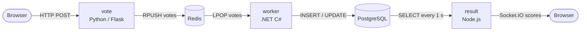

The Example Voting App is a simple distributed application from [dockersamples/example-voting-app](https://github.com/dockersamples/example-voting-app). It runs across multiple containers and demonstrates how to wire together several different languages, runtimes, and data stores inside Docker.

The app is not meant to be a production-grade architecture. It is a practical reference showing how queues, persistent storage, and multiple language runtimes coexist in a containerised environment at a basic level.

<Note>
  The voting application only accepts one vote per client browser. It does not register additional votes if a vote has already been submitted from a client.
</Note>

## What the app does

Users open a web interface, pick one of two options, and submit their vote. A background worker picks up each vote from a queue, persists it to a database, and a separate results interface shows the live tally updating in real time.

## Services

The application is composed of five services.

| Service | Image / Build | Role |
|---------|--------------|------|
| `vote` | Python Flask (built from `./vote`) | Front-end web UI. Accepts a vote from the browser and pushes it onto the Redis queue. |
| `redis` | `redis:alpine` | In-memory message queue. Holds raw votes until the worker consumes them. |
| `worker` | .NET C# (built from `./worker`) | Background consumer. Reads votes from Redis and upserts them into PostgreSQL. |
| `db` | `postgres:15-alpine` | Persistent relational store. Holds the canonical vote counts in a `votes` table. |
| `result` | Node.js (built from `./result`) | Front-end results UI. Queries PostgreSQL every second and streams live totals to the browser over Socket.IO. |

## Technology stack

| Layer | Technology |
|-------|------------|
| Vote front-end | Python 3.11, Flask, Gunicorn |
| Results front-end | Node.js, Express, Socket.IO, `pg` |
| Background worker | .NET 7, C#, StackExchange.Redis, Npgsql |
| Message queue | Redis (alpine) |
| Database | PostgreSQL 15 (alpine) |
| Container runtime | Docker Engine with Compose, Docker Swarm, or Kubernetes |

## How the data flows

## Prerequisites

You need one of the following:

- **Docker Desktop** (Mac or Windows) — Docker Compose is bundled automatically.
- **Docker Engine** (Linux) with the latest version of the [Compose plugin](https://docs.docker.com/compose/install/).

For Swarm or Kubernetes deployments you also need:

- A running Docker Swarm (`docker swarm init`) for stack deployments.
- A configured `kubectl` context pointing at a Kubernetes cluster for Kubernetes deployments.

## Next steps

<Columns cols={2}>
  <Card title="Quickstart" icon="rocket" href="/quickstart">
    Run the app locally with Docker Compose, deploy to Docker Swarm, or bring it up on Kubernetes.
  </Card>
  <Card title="Architecture" icon="diagram-project" href="/architecture">
    Explore the service topology, network layout, and data flow in detail.
  </Card>
</Columns>
